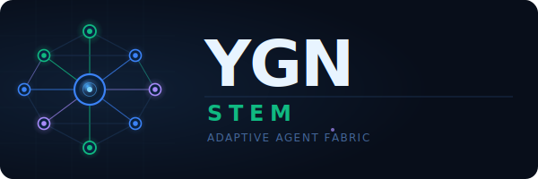

# YGN-STEM: Adaptive Agent Fabric

**The interoperability and adaptive intelligence layer of the YGN ecosystem**

<p align="center">
  
</p>

<p align="center">
  
  
  
</p>

---

## Overview

YGN-STEM is the connective tissue of the YGN ecosystem, based on the **STEM Agent paper** ([arXiv:2603.22359](https://arxiv.org/abs/2603.22359)) but substantially enhanced with SOTA innovations from March 2026.

It does **not** duplicate reasoning, execution, verification, or governance — those capabilities live in existing YGN repositories. YGN-STEM **connects, adapts, memorizes, and orchestrates** across them.

| What YGN-STEM does | What YGN-STEM delegates |
|---|---|
| Adapt to caller preferences (ACE Caller Profiler) | Cognitive reasoning → Y-GN HiveMind / SAGE pipeline |
| Select optimal agent architecture per task | Tool execution in sandbox → Y-GN Core / SAGE Wasm |
| Expose 6 standardized protocols to the world | Security guards → Meta-YGN Guard Pipeline |
| Federate cross-repo memory via 4 logical networks | Formal verification → SAGE Z3/SMT |
| Evolve portable skills via group evolution | Cryptographic proof → YGN-VM Aletheia |
| Pre-analyze between sessions (Sleep-Time Compute) | Knowledge scraping → YGN-FINANCE pipeline |

YGN-STEM is designed as a **brick**: modular, composable, making zero assumptions about final product form. Every component has value independently and in composition.

---

## Architecture

```
┌─────────────────────────────────────────────────────────────────────┐
│  LAYER 1 — PROTOCOL GATEWAY  (Express.js 5)                         │
│                                                                     │
│  A2A v0.3 | AG-UI | A2UI | MCP | UCP | AP2                         │
│  Auth · Rate Limiter · Caller Identify · Evidence Capture           │
│  Adapters: AutoGen · CrewAI · LangGraph · OpenAI Agents SDK         │
├─────────────────────────────────────────────────────────────────────┤
│  LAYER 2 — ADAPTIVE INTELLIGENCE                                    │
│                                                                     │
│  Caller Profiler (ACE, 21-dim) | Architecture Selector (87% acc.)  │
│  Skills Engine (SKILL.md + GEA) | Sleep-Time Compute (5x faster)   │
├─────────────────────────────────────────────────────────────────────┤
│  LAYER 3 — HINDSIGHT MEMORY                                         │
│                                                                     │
│  Facts (KG triples) | Experiences (episodes) |                      │
│  Summaries (entity abstractions) | Beliefs (per-caller profiles)    │
│  Retain / Recall / Reflect · UCB adaptive retrieval · RRF fusion    │
├─────────────────────────────────────────────────────────────────────┤
│  LAYER 4 — ORGAN CONNECTORS                                         │
│                                                                     │
│  Y-GN · YGN-SAGE · Meta-YGN · YGN-VM · YGN-FINANCE                 │
│  nexus-evidence · KodoClaw · future organs (plug-and-play)          │
│  Circuit breakers · Graceful degradation · Health checks            │
└─────────────────────────────────────────────────────────────────────┘
```

---

## Key Innovations

| Aspect | STEM Paper | YGN-STEM |
|---|---|---|
| **Memory** | 4 in-memory stores, basic | Hindsight 4-network (39%→91.4% accuracy), federated cross-repos, PostgreSQL+pgvector |
| **Caller adaptation** | EMA α=0.1 (context-collapse risk) | ACE Context Engineering (Generate/Reflect/Curate), anti context-collapse |
| **Architecture selection** | None (always same pipeline) | Google Scaling Science (87% accuracy, task-property analysis, 180 configs tested) |
| **Skills** | In-memory, isolated per agent | SKILL.md standard (62K+ GitHub stars), persistent PostgreSQL, GEA group evolution (71% vs 56.7% SWE-bench) |
| **Idle-time compute** | None | Sleep-Time Compute: 5x less inference compute, +18% accuracy (Letta/UC Berkeley 2025) |
| **Protocols** | 5 protocols | Same 6 + unified MCP Tool Aggregation across all organs |
| **Security** | Basic JWT/OAuth2 | Delegated to Meta-YGN (27 guards) + Trilemma Safety compliance |
| **Scalability** | In-memory maps, no distribution | PostgreSQL + Redis + Docker + circuit breakers |

---

## Monorepo Structure

```
ygn-stem/
├── packages/
│   ├── shared/           # Zod v4 schemas, types, errors, constants
│   ├── gateway/          # Express.js 5 + protocol routers + middleware pipeline
│   ├── adaptive/         # Caller Profiler + Architecture Selector + Skills Engine + Sleep-Time
│   ├── memory/           # Hindsight 4-network (Facts, Experiences, Summaries, Beliefs)
│   ├── connectors/       # Organ interfaces (MCP clients, A2A clients, CLI bridges)
│   └── commerce/         # UCP + AP2 protocol handlers
├── skills/               # SKILL.md definitions (Agent Skills standard)
├── docker/               # Dockerfile + compose (postgres/pgvector + redis + stem)
├── docs/                 # Architecture specs, inter-repo dependency map, feature docs
├── assets/               # Logos and visual assets
├── vitest.config.ts      # Workspace testing (projects pattern)
├── tsconfig.json         # nodenext + strict
└── pnpm-workspace.yaml   # pnpm workspaces
```

---

## Tech Stack

| Technology | Version | Purpose |
|---|---|---|
| TypeScript | 5.8+ | Primary language, `nodenext` module resolution, `strict` mode |
| Express.js | 5.x | Gateway HTTP framework, async error propagation |
| Zod | v4 | Schema validation (aligned with MCP SDK) |
| Vitest | 3+ | Testing (`projects` pattern for monorepo) |
| Drizzle ORM | latest | Type-safe PostgreSQL + pgvector queries |
| PostgreSQL | 17 | Primary persistence (Facts, Experiences, Summaries, Beliefs, Skills) |
| pgvector | latest | HNSW vector indexing, cosineDistance |
| Redis | 7+ | Hot cache, pub/sub, rate limiting |
| pnpm | 9+ | Monorepo workspace management |
| @modelcontextprotocol/sdk | latest | MCP server + client (Zod v4, Streamable HTTP) |
| Docker | latest | Containerized deployment |

---

## Quickstart

```bash
# Install dependencies
pnpm install

# Run tests
pnpm test:run

# Start infrastructure (PostgreSQL + Redis)
docker compose -f docker/docker-compose.yml up -d

# Start the gateway in development mode
pnpm dev
```

---

## Environment Variables

Copy `.env.example` and configure for your environment:

```bash
cp .env.example .env
```

See `.env.example` for all available variables, including:

- `DATABASE_URL` — PostgreSQL connection string (with pgvector)
- `REDIS_URL` — Redis connection string
- `YGN_CORE_MCP` — Y-GN Core MCP transport (`stdio:ygn-core mcp` or `http://...`)
- `SAGE_MCP` — YGN-SAGE MCP endpoint
- `SAGE_A2A` — YGN-SAGE A2A endpoint
- `META_YGN_MCP` — Meta-YGN MCP transport
- `ALETHEIA_CLI` — Path to the aletheia CLI binary
- `EMBEDDING_PROVIDER` — Embedding model selection (`snowflake-arctic-embed-m` default)

---

## SOTA References

| Innovation | Paper | Applied In |
|---|---|---|
| Hindsight Memory (4 networks) | [arXiv:2512.12818](https://arxiv.org/abs/2512.12818) (Dec 2025) | Layer 3 architecture |
| Memora (cue anchors) | [arXiv:2602.03315](https://arxiv.org/abs/2602.03315) (Feb 2026) | Summaries network |
| CraniMem (sleep consolidation) | [arXiv:2603.15642](https://arxiv.org/abs/2603.15642) (Mar 2026) | Sleep-Time Reflect |
| Sleep-Time Compute | [arXiv:2504.13171](https://arxiv.org/abs/2504.13171) (Letta/UCB) | Layer 2 Sleep-Time Compute |
| Google Scaling Science | [arXiv:2512.08296](https://arxiv.org/abs/2512.08296) (Dec 2025) | Architecture Selector |
| ACE Context Engineering | [arXiv:2510.04618](https://arxiv.org/abs/2510.04618) (ICLR 2026) | Caller Profiler |
| GEA Group Evolution | [arXiv:2602.04837](https://arxiv.org/abs/2602.04837) (Feb 2026) | Skills Engine |
| Self-Evolution Trilemma | [arXiv:2602.09877](https://arxiv.org/abs/2602.09877) (Feb 2026) | Safety constraint |
| A-MEM (Zettelkasten) | [arXiv:2502.12110](https://arxiv.org/abs/2502.12110) (Feb 2025) | Summaries evolution |
| xMemory (latent component) | [arXiv:2602.02007](https://arxiv.org/abs/2602.02007) (Feb 2026) | Recall strategy |
| STEM Agent (base paper) | [arXiv:2603.22359](https://arxiv.org/abs/2603.22359) (Mar 2026) | Foundation |

---

## License

MIT © 2026 Yann Abadie
